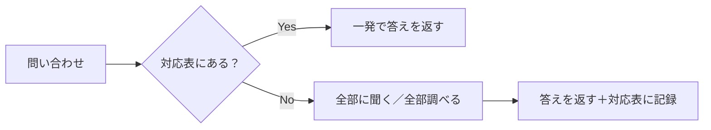

# 対応表による全探索の回避

## 捉えるもの
「どこにあるか分からない」問題に対し、対応表（テーブル/インデックス）を持つことで全探索を回避するパターン。対応表がない状態でも「全部に聞く」フォールバックで正しく動くが、スケールしない。

## 関連概念
- [database_models.md](../concepts/database_models.md) — DB（インデックス）
- [hub_and_switch.md](../concepts/hub_and_switch.md) — ネットワーク（MACアドレステーブル）
- [routing.md](../concepts/routing.md) — ネットワーク（ルーティングテーブル）
- [arp.md](../concepts/arp.md) — ネットワーク（ARPキャッシュ）
- [dns.md](../concepts/dns.md) — ネットワーク（DNSキャッシュ）
- [flooding.md](../concepts/flooding.md) — ネットワーク（フォールバックの実体）

## 構造

### 対応表がある場合 vs ない場合

| ドメイン | 対応表の名前 | 入力 | 出力 | テーブルがないときのフォールバック |
|----------|------------|------|------|--------------------------------|
| DB | インデックス | 検索キー | レコードの場所 | フルスキャン（全レコードを確認） |
| スイッチ | MACアドレステーブル | MACアドレス | ポート番号 | フラッディング（全ポートに送る） |
| ルータ | ルーティングテーブル | 宛先IPネットワーク | 次の転送先 | デフォルトゲートウェイへ丸投げ |
| ARP | ARPキャッシュ | IPアドレス | MACアドレス | ブロードキャストで全端末に聞く |
| DNS | キャッシュサーバ | ドメイン名 | IPアドレス | ルートから再帰的に全階層を探す |

### フォールバックは全部「全部に聞く」の別名

| フォールバックの名前 | 言い換え |
|--------------------|---------|
| フルスキャン | 全レコードに聞く |
| フラッディング | 全ポートに聞く |
| ブロードキャスト | 全端末に聞く |
| ルートDNSから再帰探索 | 上から順番に全部に聞く |

### 本質

対応表は「動くか動かないか」ではなく「**スケールするかしないか**」の問題。
対象が少ないうちはフォールバックでも機能するが、増えた瞬間にコストが線形に増大する。

## ソース
- 2026-05-20：/connect での壁打ちから発見（達人DB 第1章 × ネットワーク学習）
