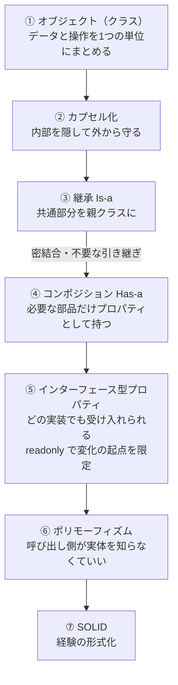

# OOP設計の進化系譜

## 捉えるもの
オブジェクト（クラス）→カプセル化→継承→コンポジション→インターフェース型プロパティ→ポリモーフィズム→SOLIDという流れは、前の手法の問題を解決するために次の概念が生まれた連鎖である。

## オブジェクト指向の歴史



| ステップ | 概要 | どう変わったか |
|---|---|---|
| ① オブジェクト（クラス） | データと操作を1つの単位にまとめる | OOPの出発点・クラスという概念そのもの |
| ② カプセル化 | 内部データを隠して外からのアクセスを制限する | 内部を隠して外から守れる |
| ③ 継承（Is-a） | 共通部分を親クラスに | 共通処理を毎回書かなくていい |
| ④ コンポジション（Has-a） | 必要な部品だけプロパティとして持つ | 必要なものだけ選べる・親の変更に引きずられない |
| ⑤ インターフェース型プロパティ | どの実装でも受け入れられる | 特定のクラスに縛られなくなった |
| ⑥ ポリモーフィズム | 呼び出し側が実体を知らなくていい | ⑤の結果として自然に手に入る性質 |
| ⑦ SOLID | 経験の形式化 | 実践の知恵を原則として言語化した |

## 構造

### ① オブジェクト（クラス） — 出発点

「データと操作を1つの単位（オブジェクト）にまとめる」。OOP全体の基本思想。

```csharp
class Character {
    public string Name;
    public int Hp;
    public void Attack() { ... }
}
```

---

### ② カプセル化 — 内部を守る

「まとめた上で、内部データを隠して外からのアクセスを制限する」。

```csharp
class Character {
    private int _hp;
    public void TakeDamage(int d) { _hp -= d; }
}
```

---

### ③ 継承（Is-a）— コードの再利用

「共通部分を親クラスにまとめて引き継ごう」という発想。

```csharp
class Character { public virtual void Attack() { ... } }
class Hero    : Character { public override void Attack() { ... } }
class Monster : Character { public override void Attack() { ... } }
```

一見スマートだが、実用上2つの問題が浮上した。

**問題1：いらないものがついてくる**
```csharp
class Turret : Character {
    // Attack() だけ欲しいのに Move(), Eat(), Sleep() も強制的についてくる
}
```

**問題2：親の変更が子を壊す（密結合）**
```csharp
class Character {
    public virtual void Attack() { Move(); DealDamage(); }  // ← 後から追加
}
// Turret は何も変えていないのに Attack() で Move() が走る → 想定外の挙動
```

---

### ④ コンポジション（Has-a）— 継承の問題を解決

「継承するんじゃなく、必要な部品をプロパティとして持てばいい」。

```csharp
class Turret {
    private Weapon _weapon;
    public Turret(Weapon weapon) { _weapon = weapon; }
    public void Attack() => _weapon.Attack();
}
```

---

### ⑤ インターフェース型プロパティ — コンポジションの進化

「プロパティの型をインターフェースにすれば、その型を持つオブジェクトならなんでも受け入れられる」。

```csharp
class Turret : IAttackable {
    private readonly IAttackable _attacker;
    public Turret(IAttackable attacker) { _attacker = attacker; }
    public void Attack() => _attacker.Attack();  // 委譲
}
```

---

### ⑥ ポリモーフィズム — インターフェースから生まれる性質

インターフェースで型を統一したことで、呼び出し側が実体を知らなくていい状態が生まれた。

```csharp
List<IAttackable> units = new() { new Turret(...), new Hero(...), new Drone(...) };
foreach (var u in units) {
    u.Attack();
}
```

---

### ⑦ SOLID — 経験の形式化

| 原則 | 自分の言葉 | OOPの流れとの接続 |
|---|---|---|
| S（単一責任） | 修正時の影響範囲を最小限にするための、クラスの切り分けの話 | ③継承の問題「親の変更が子を壊す」と根っこは同じ |
| O（開放閉鎖） | 最小限の変更で拡張できるようにしろ（目的）。実現手段はDが担う | ⑤〜⑥で手に入れた設計状態を言語化したもの |
| L（リスコフ置換） | 拡張ではなく塗り替えをするな。Is-a でも使い方の約束を守れ | ③継承を正しく使うための制約 |
| I（インターフェース分離） | インターフェースは細切れにしろ。盛り込んだら具体クラスと変わらん | ⑤インターフェース型プロパティを正しく使うための制約 |
| D（依存性逆転） | プロパティの型をインターフェース型にして、柔軟に付け替えられるようにしろ | ⑤の直接の言語化。OCPの実現手段 |

SOLIDは後付けの命名であり、OOPの実践から自然に浮かび上がってきた知恵の結晶。

## ソース
- 2026-05-30：/study → /connect での壁打ちから発見
