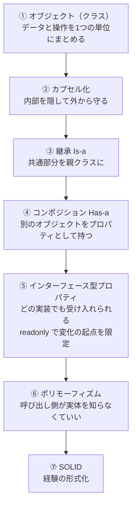

# OOP設計の進化系譜

## 捉えるもの
オブジェクト（クラス）→カプセル化→継承→コンポジション→インターフェース型プロパティ→ポリモーフィズム→SOLIDという流れは、前の手法の問題を解決するために次の概念が生まれた連鎖である。

## オブジェクト指向の歴史

| ステップ | 概要 | どう変わったか |
|---|---|---|
| ① オブジェクト（クラス） | データと操作を1つの単位にまとめる | OOPの出発点・クラスという概念そのもの |
| ② カプセル化 | 内部データを隠して外からのアクセスを制限する | 内部を隠して外から守れる |
| ③ 継承（Is-a） | 共通部分を親クラスに | 共通処理を毎回書かなくていい |
| ④ コンポジション（Has-a） | 別のオブジェクトをプロパティとして持つ | 必要なものだけ選べる・親の変更に引きずられない |
| ⑤ インターフェース型プロパティ | どの実装でも受け入れられる | 特定のクラスに縛られなくなった |
| ⑥ ポリモーフィズム | 呼び出し側が実体を知らなくていい | ⑤の結果として自然に手に入る性質 |
| ⑦ SOLID | 経験の形式化 | 実践の知恵を原則として言語化した |

## 構造

- ① オブジェクト（クラス）：詳細は [oop_encapsulation.md](../concepts/oop_encapsulation.md)
- ② カプセル化：詳細は [oop_encapsulation.md](../concepts/oop_encapsulation.md)
- ③ 継承（Is-a）：詳細は [inheritance.md](../concepts/inheritance.md)
- ④ コンポジション（Has-a）：詳細は [composition.md](../concepts/composition.md)
- ⑤ インターフェース型プロパティ：詳細は [oop_interface.md](../concepts/oop_interface.md)
- ⑥ ポリモーフィズム：詳細は [polymorphism.md](../concepts/polymorphism.md)

### ⑦ SOLID — OOP進化との接続

SOLIDは後付けの命名であり、OOPの実践から自然に浮かび上がってきた知恵の結晶。
各原則がこの進化のどのステップと対応するかが、mapとして唯一の視点。

| 原則 | OOPの流れとの接続 |
|---|---|
| S（単一責任） | ③継承の問題「親の変更が子を壊す」と根っこは同じ |
| O（開放閉鎖） | ⑤〜⑥で手に入れた設計状態を言語化したもの |
| L（リスコフ置換） | ③継承を正しく使うための制約 |
| I（インターフェース分離） | ⑤インターフェース型プロパティを正しく使うための制約 |
| D（依存性逆転） | ⑤の直接の言語化。OCPの実現手段 |

→ 各原則の詳細は [solid_principles.md](../concepts/solid_principles.md)

## ソース
- 2026-05-30：/study → /connect での壁打ちから発見

## 関連概念
- [oop_encapsulation.md](../concepts/oop_encapsulation.md) — OOP（カプセル化）
- [inheritance.md](../concepts/inheritance.md) — OOP（継承）
- [composition.md](../concepts/composition.md) — OOP（コンポジション）
- [oop_interface.md](../concepts/oop_interface.md) — OOP（インターフェース）
- [polymorphism.md](../concepts/polymorphism.md) — OOP（ポリモーフィズム）
- [solid_principles.md](../concepts/solid_principles.md) — 設計原則
