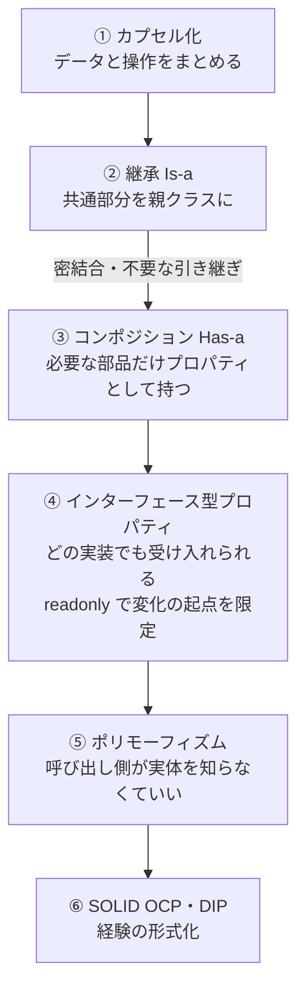

# OOP設計の進化系譜

## 捉えるもの
カプセル化→継承→コンポジション→インターフェース→ポリモーフィズム→SOLIDという流れは、前の手法の問題を解決するために次の概念が生まれた連鎖である。

## 図



## 関連概念
- [oop_encapsulation.md](../concepts/oop_encapsulation.md) — OOP（カプセル化）
- [inheritance.md](../concepts/inheritance.md) — OOP（継承）
- [composition.md](../concepts/composition.md) — OOP（コンポジション）
- [oop_interface.md](../concepts/oop_interface.md) — OOP（インターフェース）
- [polymorphism.md](../concepts/polymorphism.md) — OOP（ポリモーフィズム）
- [solid_principles.md](../concepts/solid_principles.md) — 設計原則
- [dependency_inversion.md](../concepts/dependency_inversion.md) — 設計原則（DIP）

## 構造

### ① カプセル化 — 出発点

「データと操作を1つにまとめ、外から直接いじらせない」。OOPの土台。

```csharp
class Character {
    private int _hp;
    public void TakeDamage(int d) { _hp -= d; }
}
```

---

### ② 継承（Is-a）— コードの再利用

「共通部分を親クラスにまとめて引き継ごう」という発想。

```csharp
class Character { public virtual void Attack() { ... } }
class Hero    : Character { public override void Attack() { ... } }
class Monster : Character { public override void Attack() { ... } }
```

一見スマートだが、実用上2つの問題が浮上した。

**問題1：いらないものがついてくる**
```csharp
class Turret : Character {
    // Attack() だけ欲しいのに Move(), Eat(), Sleep() も強制的についてくる
}
```

**問題2：親の変更が子を壊す（密結合）**
```csharp
class Character {
    public virtual void Attack() { Move(); DealDamage(); }  // ← 後から追加
}
// Turret は何も変えていないのに Attack() で Move() が走る → 想定外の挙動
```

---

### ③ コンポジション（Has-a）— 継承の問題を解決

「継承するんじゃなく、必要な部品をプロパティとして持てばいい」。

```csharp
class Turret {
    private Weapon _weapon;  // クラスを型として持つ
    public Turret(Weapon weapon) { _weapon = weapon; }
    public void Attack() => _weapon.Attack();
}
```

不要なメソッドはついてこない。親クラスが変わっても影響を受けない。

---

### ④ インターフェース型プロパティ — コンポジションの進化

「プロパティを具体クラス（`Weapon`）にするとまだ特定の型に縛られる。インターフェースにすれば、その型を持つオブジェクトならなんでも受け入れられる」。

`readonly` をつけることで変化の起点をコンストラクタの一箇所に限定し、問題の切り分けをしやすくする。

```csharp
class Turret : IAttackable {
    private readonly IAttackable _attacker;  // インターフェース型で持つ
    public Turret(IAttackable attacker) { _attacker = attacker; }
    public void Attack() => _attacker.Attack();  // 処理はプロパティに丸投げ（委譲）
}

new Turret(new Sword());
new Turret(new MagicWand());  // どちらでも入れられる
```

---

### ⑤ ポリモーフィズム — インターフェースから生まれる性質

インターフェースで型を統一したことで、呼び出し側が実体を知らなくていい状態が生まれた。

```csharp
List<IAttackable> units = new() { new Turret(...), new Hero(...), new Drone(...) };
foreach (var u in units) {
    u.Attack();  // 実体が何であれ、正しい Attack() が呼ばれる
}
```

コンポジション＋インターフェースの結果として自然に手に入る性質。

---

### ⑥ SOLID（特にOCP・DIP）— 経験の形式化

長年の実践から浮かび上がったパターンを原則として言語化したもの。

| 原則 | 一言 | OOPの流れでいうと |
|---|---|---|
| OCP（開放閉鎖） | 拡張には開いて、修正には閉じろ | 新しい型を追加しても呼び出し側を変えなくていい（インターフェースで実現） |
| DIP（依存性逆転） | 具体ではなく抽象に依存しろ | `Weapon` ではなく `IAttackable` に依存せよ（コンポジション×インターフェース） |

SOLIDは後付けの命名であり、OOPの実践から自然に浮かび上がってきた知恵の結晶。

## ソース
- 2026-05-30：/study → /connect での壁打ちから発見
