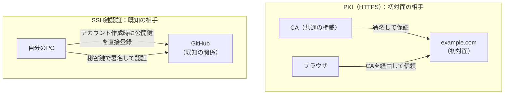

# 公開鍵暗号の2つの信頼モデル

## 捉えるもの
同じ公開鍵暗号を使っていても、「誰と通信するか」によって信頼の確立方法がまったく異なる。事前に関係があるかどうかが、CAが必要か不要かを決める。

## 関連概念
- [pki.md](../concepts/pki.md) — CA階層による信頼（HTTPS）
- [ssh_key_auth.md](../concepts/ssh_key_auth.md) — 直接登録による信頼（SSH）

## 構造

### 2つのモデルの違い

| | PKI（HTTPS） | SSH鍵認証 |
|---|---|---|
| 解く問題 | 初対面の相手を信頼する | 既知の相手に自分を証明する |
| 信頼の確立 | CAが「本物」と署名して保証 | 事前に公開鍵を直接登録 |
| 第三者が必要か | 必要（CA） | 不要 |
| 信頼の構造 | 階層（ルートCA → 中間CA → 証明書） | 直接（登録した鍵のみ信頼） |

### なぜ差が出るか
「事前に関係があるかどうか」が分岐点。

**PKI：不特定多数の見知らぬ相手を信頼したい**
- 初めて訪れるWebサイトに事前に公開鍵を登録しておく手段がない
- 世界中の何百万サイトを、共通の権威（CA）なしに信頼するのは不可能
- → CAという共通の第三者が必要になる

**SSH：特定の既知の相手だけを信頼したい**
- GitHubにアカウントを作った時点で関係が確立されている
- そのタイミングで公開鍵を直接登録できる
- → CAは不要。事前の関係が信頼の根拠になる

### 図

### 同じパターンが現れる場所
- **DKIM（メール送信ドメイン認証）**：公開鍵をDNSに直接公開。CAなしで「このドメインから来たメールは本物」を証明する → SSHに近いモデル

## タグ
公開鍵暗号, 信頼モデル, PKI, SSH, CA, セキュリティ, 認証
