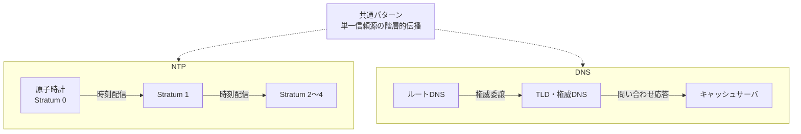

# 単一信頼源の階層的伝播

## 捉えるもの
「唯一の正解」を持つ信頼源が1つしかないとき、全員が直接問い合わせると破綻する。この制約を、階層的な中継構造で解くパターン。異なるプロトコルが独立に同じ解法へたどり着いている（収束設計）。

## 関連概念
- [ntp.md](../concepts/ntp.md) — 時刻の正確さをStratumで階層的に伝播
- [dns.md](../concepts/dns.md) — 名前解決の権威をルート→TLD→権威DNSで階層的に委譲

## 構造

### 共通の問題
- 単一の信頼源（原子時計・ルートDNSサーバ）が存在する
- しかし全クライアントが直接問い合わせると負荷が集中して破綻する

### 共通の解法：階層化と中継

| 要素 | NTP | DNS |
|------|-----|-----|
| 単一信頼源 | 原子時計（Stratum 0） | ルートDNSサーバ |
| 中継層 | Stratum 1, 2, 3... | TLDサーバ・権威DNS・キャッシュサーバ |
| クライアントが接触する層 | Stratum 2〜4 | キャッシュサーバ（フルサービスリゾルバ） |
| 上位への負荷を減らす仕組み | 各Stratumが時刻配信を分担 | キャッシュが大半の問い合わせを吸収 |

### 重要な特性：「十分な近似」で成立する
- NTP：Stratum 3〜4でも実用上十分な精度が得られる
- DNS：キャッシュサーバのキャッシュが「大体ある」状態で成立する
- 信頼源から遠ざかるほど厳密さは落ちるが、実用上は問題ない

### 他に同じパターンが現れる場所
- **PKI（公開鍵インフラ）**：ルート認証局 → 中間CA → エンドエンティティ証明書
- **BGP（ルーティング）**：AS間でルーティング情報を階層的に伝播

## 図

## タグ
階層化, 負荷分散, 収束設計, NTP, DNS, スケーラビリティ, 単一信頼源
