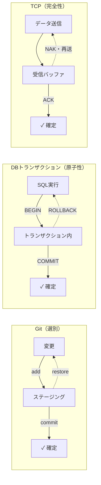

# バッファ→確定パターン（Staged Commitment）

## 捉えるもの
「直接確定せず中間状態に保留することで、確定のタイミングと単位をコントロールする」という構造が、Git・DB・ネットワークという異なるドメインに共通して現れる。

## 関連概念
- [git.md](../concepts/git.md) — バージョン管理
- [sliding_window.md](../concepts/sliding_window.md) — ネットワーク / TCP
- db_transaction.md — データベース（未作成）

## 構造

### 各ドメインでの実現

| ドメイン | 中間状態 | 確定操作 | 保留の目的 |
|---|---|---|---|
| Git | ステージングエリア | commit | 意味の単位を自分で選別する |
| DBトランザクション | トランザクション内 | COMMIT | 全部成功したときだけ確定（原子性） |
| TCP | 受信バッファ | ACK | 全部届いてから確定（順序保証） |
| CI/CDパイプライン | ビルド・テストステージ | デプロイ | 全ステージ通過後に本番確定 |

### 共通する抽象構造

### 保留の理由は文脈によって異なる
- **選別**（Git）：何をひとまとめにするか自分で決める
- **原子性**（DB）：全部成功したときだけ確定、失敗したら全部戻す
- **完全性**（TCP）：全部揃ってから確定、欠けたら再送

「全部揃ってからやる」は原子性・完全性のケースに近いが、Gitは「意味を整えてから」という別の理由。いずれも「直接確定すると取り返しがつかないから中間状態で制御する」という設計思想が根底にある。

### 関連する名前付き概念
- 2フェーズコミット（2PC）：分散システムでの「準備→確定」2段階
- Atomicity（原子性）：ACID特性の一つ
