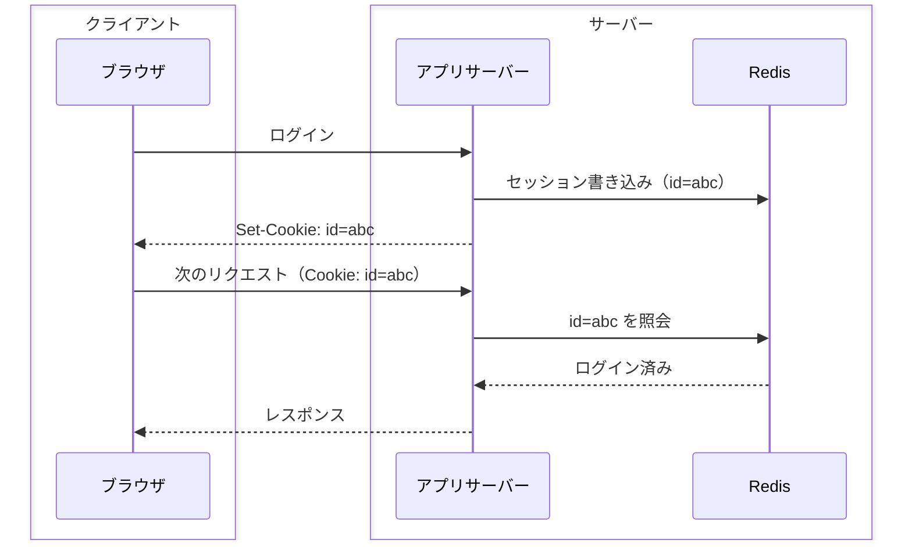
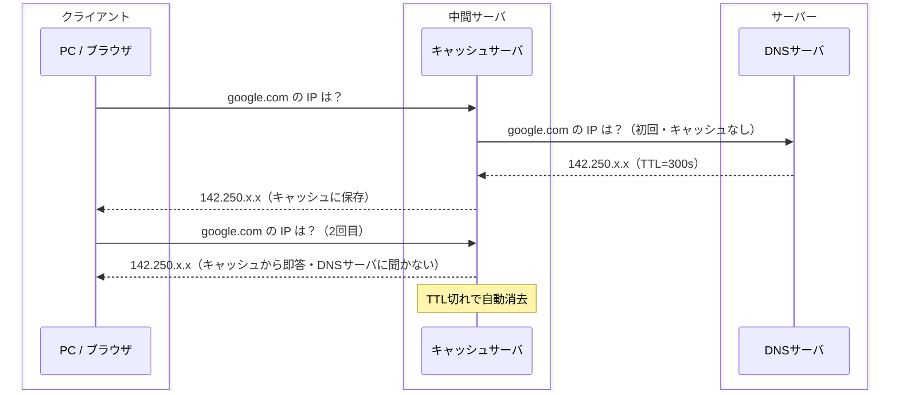
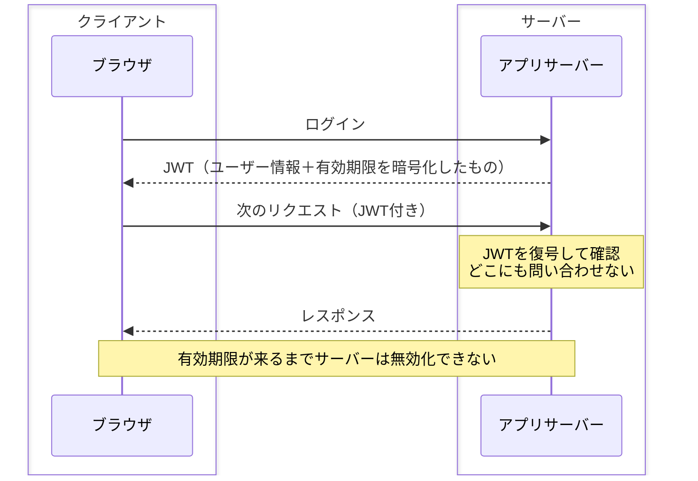

# 状態の置き場所トレードオフ

## 捉えるもの
「確認コストを減らすために状態をどこに置くか」という問いが、セッション管理・DNS・HTTP・認証など複数ドメインで同じトレードオフ構造として現れる。

## 関連概念
- [session_management.md](../concepts/session_management.md) — セッション管理（Cookie + Redis / JWT）
- [dns.md](../concepts/dns.md) — ネットワーク（DNSキャッシュ・TTL）
- [http.md](../concepts/http.md) — Web（HTTPキャッシュ）
- [load_balancer.md](../concepts/load_balancer.md) — インフラ（分散サーバーでの状態管理）

## 構造

### 中心にある問い
毎回確認するのはコストがかかる。だから「どこかに覚えておく」。  
**誰が覚えるか**によって速さと制御可能性が変わる。

### 3つの置き場所と具体例

| 置き場所 | 具体例 | 速さ | 無効化しやすさ |
|---|---|---|---|
| サーバー側 | Cookie + Redis | ×（毎回問い合わせ） | ◎（即時反映できる） |
| 中間サーバ | DNSキャッシュ / CDN | ○（問い合わせ削減） | △（TTLで管理） |
| クライアント側 | JWT / HTTPキャッシュ | ◎（問い合わせゼロ） | ×（有効期限頼み） |

### 各パターンのフロー

**① サーバー側に置く（Cookie + Redis）**

**② 中間サーバに置く（DNSキャッシュ）**

**③ クライアント側に置く（JWT）**

### 共通する原則
> 速さと制御のトレードオフは、**状態をどこに置くか**で決まる

- サーバーに近いほど制御しやすく、遅い
- クライアントに近いほど速く、無効化しにくい
- TTL・有効期限は「時間で鮮度を管理する」という共通の解法

### 派生する実務パターン
- JWTの有効期限を短く（15分〜1時間）設定するのはなぜか → クライアント側に置いた状態を疑似的に早く無効化するため
- DNSのTTLをサーバ移転前に短くするのはなぜか → 中間キャッシュの古い状態が早く消えるようにするため

## ソース
- 2026-05-14：/study「イラスト図解式ネットワークの基本 第5章」→ /connect での壁打ちから発見
