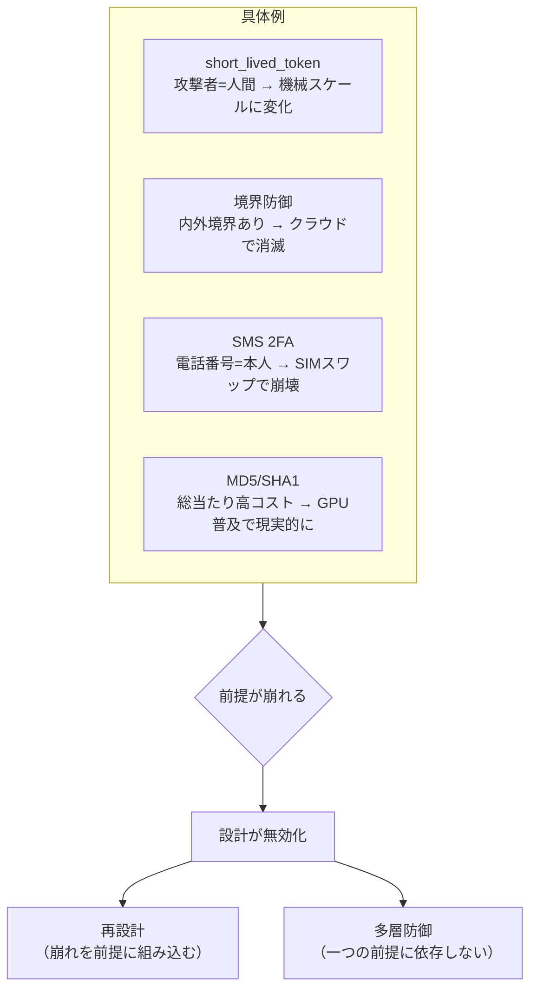

# 脅威モデルの前提崩壊（Threat Model Assumption Collapse）

## 捉えるもの
セキュリティ設計は「想定した攻撃者像・攻撃手段・攻撃速度」の範囲内でしか有効でない。その前提が技術の進化や環境の変化によって崩れると、正しく設計されたはずの仕組みが無効化される。

## 関連概念
- [short_lived_token.md](../concepts/short_lived_token.md) — 人間スケールの漏洩を前提とした設計
- [github_actions_security.md](../concepts/github_actions_security.md) — 機械スケールの攻撃で前提が崩れた事例
- [supply_chain_attack.md](../concepts/supply_chain_attack.md) — 信頼の連鎖が武器になったパターン

## 構造

### 具体例

| 設計 | 当初の前提 | 何が変わったか | 結果 |
|------|-----------|--------------|------|
| short_lived_token | 攻撃者は人間。漏洩から悪用まで時間がある | CI/CDパイプライン内でマルウェアがミリ秒で悪用 | 有効期限が意味をなさない |
| 境界防御（ファイアウォール） | 脅威は外から来る。内側は安全 | クラウド・リモートワークで内外の境界が消えた | 内側にいるだけで信頼するモデルが崩壊 |
| SMS二要素認証 | 電話番号 = 本人の証明 | SIMスワッピングで番号乗っ取りが可能になった | SMSが届く ≠ 本人 |
| MD5 / SHA1ハッシュ | 総当たりは計算コストが高すぎる | GPUの並列計算能力が数千倍になった | ブルートフォースが現実的になった |

### 対応の方向性

前提が崩れたとき、対応は2パターンに分かれる：

| 対応 | 内容 | 例 |
|------|------|-----|
| 前提を再設計する | 「前提が崩れること」を前提にする | ゼロトラスト（内側でも検証する） |
| 多層防御にする | 一つの前提に依存しない | short_lived_token + IP制限 + 最小権限の3点セット |

## 図

