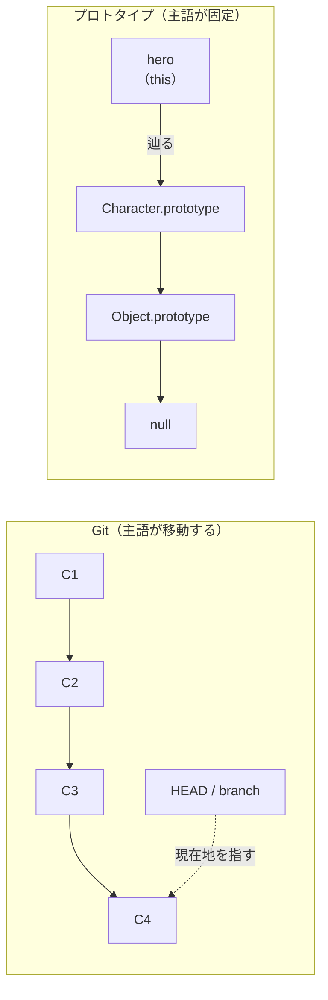

# 一方向参照チェーン

## 捉えるもの
各ノードが「自分のデータ＋親への参照」だけを持つ連鎖構造。
子を知らないため一方向にしか辿れない。同じ構造でも「主語が変わるか」で
目的と使われ方が分かれる。

## 関連概念
- [prototype_oop.md](../concepts/prototype_oop.md) — JS（プロトタイプチェーン）
- [git.md](../concepts/git.md) — バージョン管理（コミットチェーン）

## 構造

### 共通する構造

| | Git | プロトタイプ（JS） |
|---|---|---|
| 各ノードが持つもの | 自分のID＋親のID | 自分のプロパティ＋親への参照 |
| 辿れる方向 | 過去のみ | 上（親）のみ |
| 子を知るか | 知らない | 知らない |
| 終端 | 最初のコミット | null |

### 主語が変わるか／変わらないか

同じ一方向チェーンでも、主語（起点）が固定か移動かで目的が分かれる。

| | Git | プロトタイプ |
|---|---|---|
| 主語 | HEAD（移動する） | インスタンス＝`this`（固定） |
| チェーンの目的 | 主語を動かして歴史を見る | 主語を固定したまま答えを探す |
| 現在地の管理 | ブランチ＋HEADで別管理が必要 | インスタンス自身が常に起点 |

**Gitは主語（HEAD）が変わる**ので、「今どこにいるか」を別に管理する
仕組み（ブランチ）が必要になる。
**プロトタイプは主語（`this`）が変わらない**ので、どこまで辿っても
呼び出し元のインスタンスが主語のまま。現在地という概念が発生しない。

## 図

## ソース
- 2026-05-30：/study → /connect での壁打ちから発見
